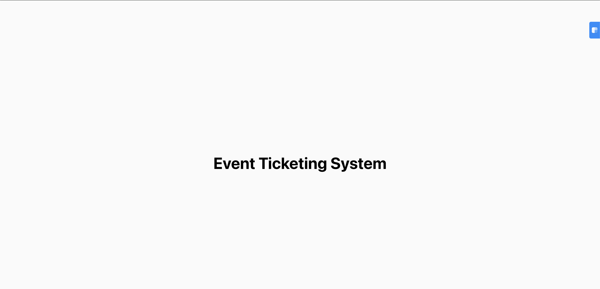
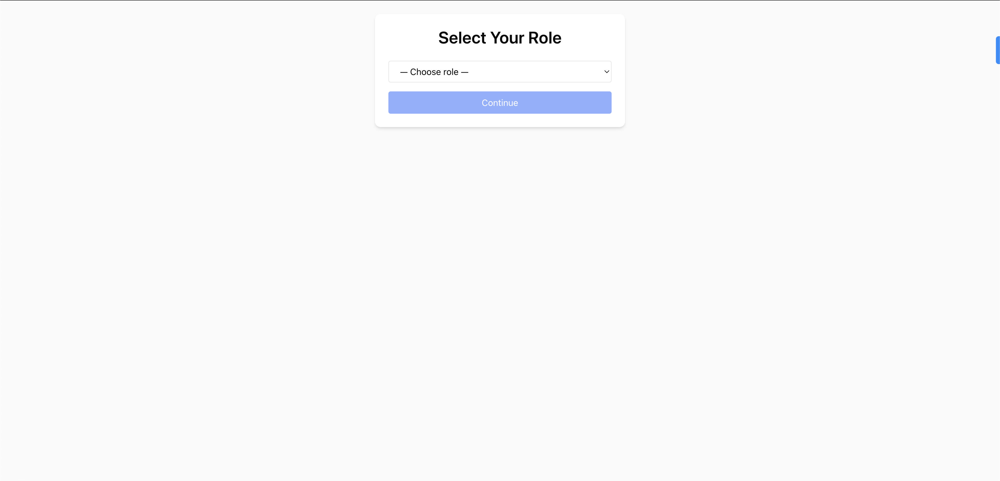
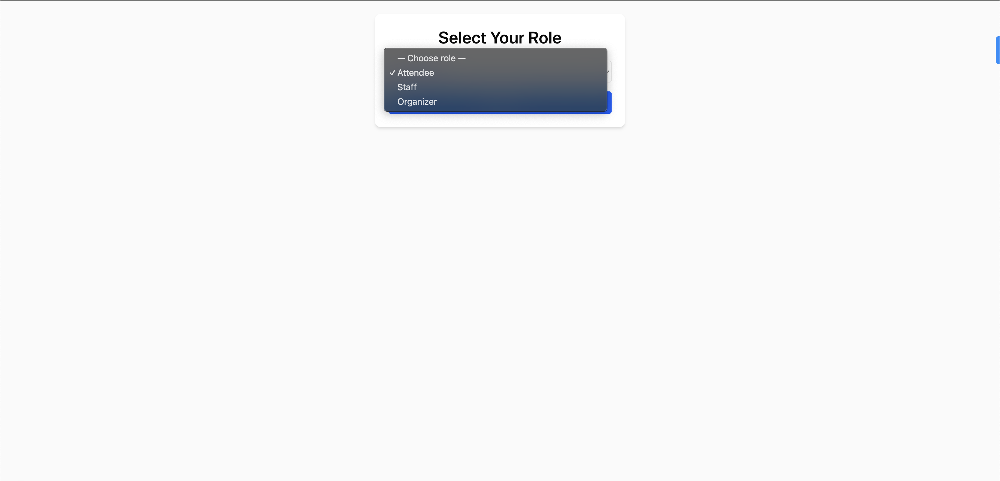
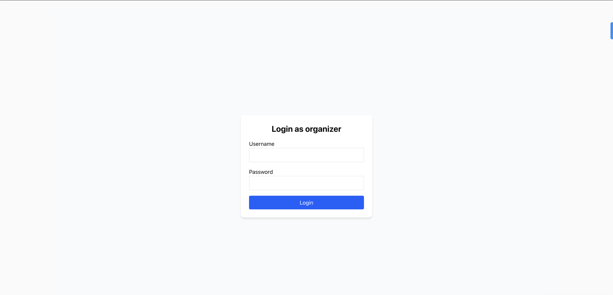
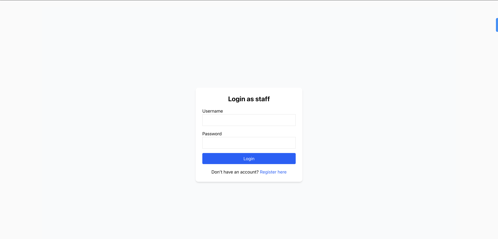
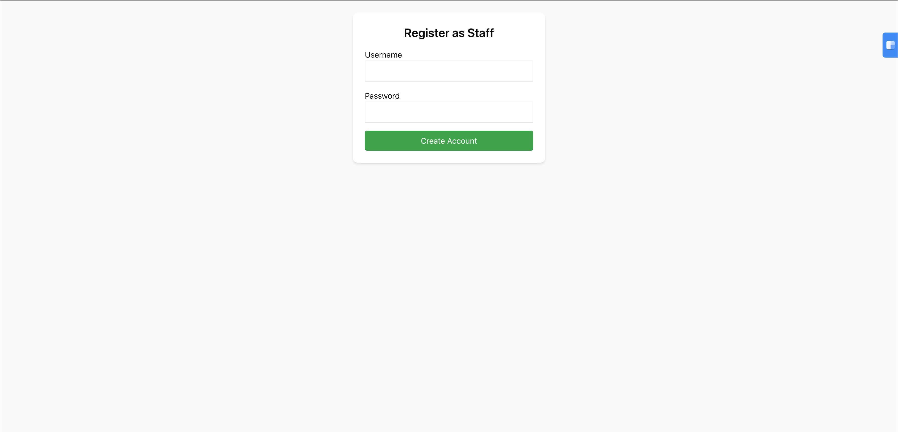
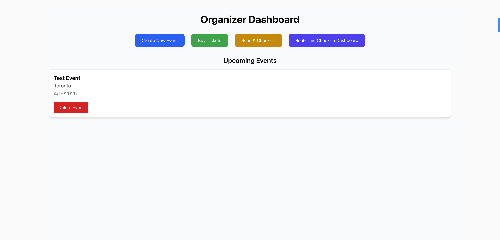
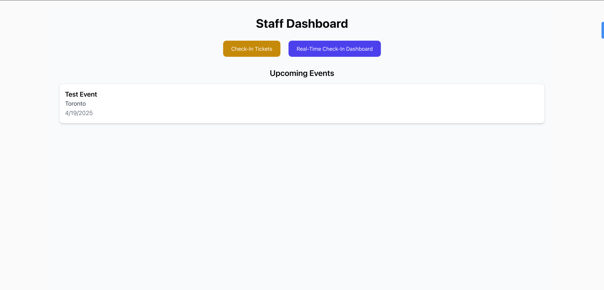
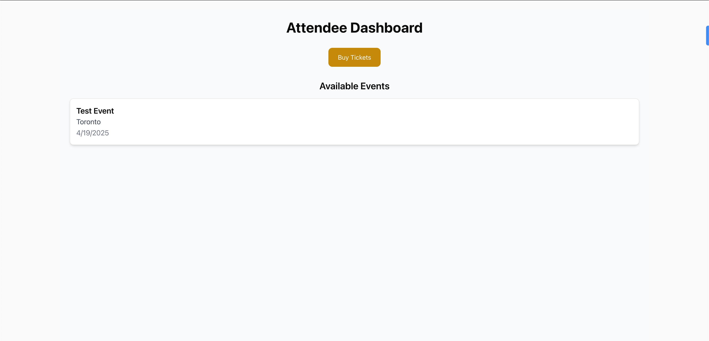

# Final Report

## Team Information

- **Member 1**: Joseph Thaliath (1003604209) • joseph.thaliath@mail.utoronto.ca

---

## Motivation

### Identified Problem

Small to mid-sized event organizers often need an efficient system to manage ticket sales and check-ins.
The existing solutions are expensive and have alot of overhead.
We have created an Event Management System where events can be created, tickets can be purchased, scanned and the staff/organizer can keep track of all tickets checked-in.

### Why This Project?

- **Focused Functionality:** The system will cover the basic needs of event management.
- **Rapid Development:** A simplified approach allows the project to be completed quickly.
- **User-Friendly Design:** A clean, responsive design ensures an easy experience for both organizers, staff and attendees.

### Target Users

- Event organizers
- On-site staff
- Attendees

---

## Objectives

List the key objectives you set out to achieve:

- Implement role-based access (Organizer, Staff, Attendee)
- Secure authentication using NextAuth.js
- Event creation and management
- Ticket generation with QR codes and email notifications
- Real-time check‑in dashboard

1. **Basic User Authentication**

   - **What:** Implemented a simple login system for Organizers and Staff.
   - **How:** Utilize Next.js built-in authentication and session management.

   Since the management system will be operated a single organizer, one default user was created with account:

   **Username:** `Organizer`
   **Password:** `organizer123`

   Staff user does not have a default user account but has the ability to register for a new account.
   The Attendee user does not need any login credentials.

2. **Event and Ticket Management**

   - **Event Creation:** Organizers can create events with basic details such as event name, date, and location.
   - **Ticket Generation:** Each ticket will have a unique QR code.

   This Organizer user has the ability to create tickets, buy tickets and Scan ticket QR codes and view the real time checkin.
   The Staff user has the ability to Scan/Check-in tickets and view the real time check-in dashboard.
   Attendee user can only purchase tickets based on the available events.

3. **QR Code Check-In Interface**

   - **What:** A mobile-responsive page where QR codes can be entered or scanned to mark a ticket as checked in.
   - **How:** Use API calls to update the check-in status.

   The QR code is generated uniquely for each ticket along with a ticket code.
   The QR code upon ticket purchase will be sent to the email provided along with additional details about the ticket, like the tier, price and event name.

4. **Data Storage and File Handling**

   - **Database:** PostgreSQL will be used.
   - **Cloud Storage:** Employed if needed for storing event assets and QR code images.

   Currently we haven't employed any cloud based storage systems, just a local PostgreSQL storage system.

---

## Technical Stack

- **Framework**: Next.js (App Router)
- **Authentication**: NextAuth.js (JWT sessions)
- **Database**: PostgreSQL with Prisma ORM
- **Email**: NodeMailer (SMTP) - Used to send an automated email upon ticket purchase.
- **QR Codes**: `qrcode` package - used to create the QR code for each ticket.
- **Styling**: Tailwind CSS
- **Real-time**: SWR for polling - Used for the Real Time Check-in Dahsboard.

---

## Features

## Frontend Requirements

| Requirement                                | Fulfilled? | Implementation Details                                                             |
| ------------------------------------------ | :--------: | ---------------------------------------------------------------------------------- |
| **React or Next.js for UI development**    |     ✓      | Built with **Next.js 15** using the App Router (`src/app/`).                       |
| **Tailwind CSS for styling**               |     ✓      | All components styled via Tailwind utility classes (e.g. `bg-white`, `shadow-md`). |
| **shadcn/ui or similar component library** |     —      | No external component library; custom React/Tailwind components only.              |
| **Responsive design implementation**       |     ✓      | Layouts use responsive Tailwind classes and flex/grid utilities.                   |

---

## Data Storage Requirements

| Requirement                                      | Fulfilled? | Implementation Details                                                                          |
| ------------------------------------------------ | :--------: | ----------------------------------------------------------------------------------------------- |
| **PostgreSQL or SQLite for relational database** |     ✓      | PostgreSQL via **Prisma ORM** (`prisma/schema.prisma`).                                         |
| **Cloud storage for file handling**              |     •      | QR codes are stored as Data URLs in your database, so no external file/cloud storage is needed. |

---

## Architecture Approach

**Next.js Full‑Stack**

- **App Router**: Pages & layouts under `src/app/`.
- **Server Components & Actions**: Initialization (`createOrganizer()` initilizes default Organizer account) in `app/layout.tsx`; Prisma calls in API routes.
  - Leveraged Server Components in src/app/layout.tsx (to seed the organizer) and API routes under src/app/api/\*.
- **API Routes**: Defined under `src/app/api/*` for `/events`, `/tickets`, and auth.
- **Client Components**: Interactive forms/dashboard marked with `"use client"`.

---

## Advanced Features

| Feature                                    | Fulfilled? | Implementation Details                                                                      |
| ------------------------------------------ | :--------: | ------------------------------------------------------------------------------------------- |
| **User authentication & authorization**    |     ✓      | NextAuth.js with `CredentialsProvider`, JWT sessions, and role‑based redirects.             |
| **Real‑time functionality**                |     ✓      | SWR polling every 5 s on `/api/tickets` to power the live check‑in dashboard.               |
| **File handling & processing**             |     ✓      | QR code generation via the `qrcode` library; stored as Data URLs in each Ticket record.     |
| **Advanced state management**              |     •      | React hooks (`useState`/`useEffect`) and `useSession` for auth state.                       |
| **API integration with external services** |     ✓      | Outgoing email via Nodemailer (SMTP) for ticket confirmations with embedded QR code images. |

---

## User Guide

1. **Home (Splash)**: View intro, auto-transition to role page.
   
2. **Role Selection**: Pick Attendee/Staff/Organizer.
   

   - Now select the desire role from the drop down
     

3. **Login/Register**:

   - Organizer: Sign in at `/login?role=...`.

     - Use default Organizer account, _Username:_ Organizer and _Password:_ organizer123
       

   - Staff: Sign in at `/login?role=...`.  
      

     - Staff can self-register at `/register`.
       

   - Attendee: Directly lands on attendee dashboard.

4. **Organizer**:

   - `/organizer`: View list of events and delete events
   - `/tickets/create`: Generate tickets for attendees.
   - `/tickets/checkin`: Scan to check in tickets.
   - `/tickets/dashboard`: Real-time overview of all tickets.

   

5. **Staff**:

   - `/staff`: View list of events
   - `/tickets/checkin`: Scan to check in tickets.
   - `/tickets/dashboard`: Real-time overview of all tickets.

   

6. **Attendee**:

   - `/attendee`: View list of events
   - `/tickets/create`: Buy tickets for events.

   

---

## Development Guide

1. **Environment Setup**:
   - Install Node.js, PostgreSQL.
   - Clone repo, run `npm install`.
   - Copy `.env.example` ➔ `.env`, set `DATABASE_URL`, `NEXTAUTH_URL`, SMTP vars.
   - The default SMTP credentials is using my account to send the automated emails. Modify this an add your own email and password as required.
2. **Database Initialization**:
   ```bash
   npx prisma migrate dev --name init
   ```
3. **Local Development**:
   ```bash
   npm run dev
   ```
   - Visit `http://localhost:3000`.
4. **Testing**:
   - Use Postman or `fetch` in browser to hit `/api/events` and `/api/tickets`.
   - Navigate through different pages and examine functionality.
5. **Code Structure**:
   - `/app`: Next.js App Router pages and layout
   - `/lib/prisma.ts`: Prisma client & default organizer seed
   - `/app/api`: API routes for events, tickets, auth
   - `/components`: Reusable React UI components

---

## Deployment Information

- Currently deployed on `localhost:3000` (default) only by running `npm run dev`

---

## Individual Contributions

| Member          | Contributions                                                                                                           |
| --------------- | ----------------------------------------------------------------------------------------------------------------------- |
| Joseph Thaliath | Auth setup, NextAuth callbacks, seeding, Event API & UI, Prisma models,Ticket generation, QR/email, real-time dashboard |

---

## Future implementations

Currently this project only allows for one organizer per site as we are using the same database schema shared Which means multiple organizers won't yet be able to use this website simultaneously. Due to the complexity of implementing such a system and the lack of enough team members to broaden this scope we ad to shy away from this implementation. But in the future iteration of this project we will be adding this feature as well.

---

## Lessons Learned and Concluding Remarks

One of the harder challenges in the beginning was to integrate NextAuth with Prisma for user authentication.
There were issues we encountered as part Server/client component boundaries in Next.js 15.
Implemented the real time handling of UI updates (checked-in tickets) with SWR which taught me about the importance such real-time updates in common web applications.

## Video Demo

https://drive.google.com/file/d/15zjRjPyZ0JJdVoelTN5Fk7W-LfGgQLYZ/view?usp=sharing

##
